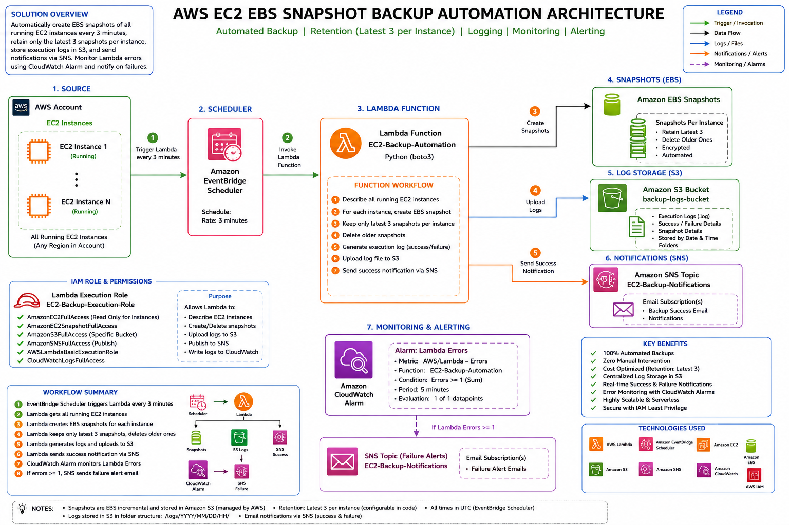

# EC2 Automated Backup & Retention Pipeline

A **serverless, event-driven backup automation system** that discovers tagged EC2 instances, creates AMIs and EBS snapshots on a schedule, enforces a retention policy, and reports every action via SNS and S3-archived logs.

---

## 1. Architecture Overview

```
                         ┌─────────────────────────────┐
                         │   Amazon EventBridge Rule    │
                         │  EC2-Backup-3Min-Schedule    │
                         │   (rate: every 3 minutes)    │
                         └──────────────┬───────────────┘
                                        │ triggers
                                        ▼
┌───────────────────────────────────────────────────────────────────────┐
│                     AWS Lambda: EC2_Lambda_backup                     │
│                        Runtime: Python 3.14                           │
│                                                                         │
│  1. Discover EC2 instances by tag filter (Environment/ManagedBy)      │
│  2. Create AMI (idempotent — skipped if one already exists)           │
│  3. Snapshot root EBS volume (retry with exponential backoff)         │
│  4. Enforce snapshot retention policy (delete oldest beyond N)        │
│  5. Upload structured logs to S3                                      │
│  6. Publish run summary to SNS                                        │
└───────┬───────────────────┬───────────────────┬───────────────────────┘
        │                   │                   │
        ▼                   ▼                   ▼
┌───────────────┐   ┌───────────────┐   ┌────────────────────┐
│  Amazon EC2    │   │  Amazon S3     │   │   Amazon SNS       │
│  (AMI/Snapshot │   │  ec2lambda-    │   │   SNS_Lambda_backup│
│   operations)  │   │  backups3      │   │   → Email/other    │
│                │   │  (log archive) │   │     subscribers    │
└───────────────┘   └───────────────┘   └────────────────────┘

Execution Role: EC2_Lambda_backup_S3IAM-ROLE
Logs: Amazon CloudWatch Logs
```

**Design pattern:** Fan-out-free, single-function scheduled worker. Stateless between invocations — all "state" (which snapshots exist, which are stale) is derived at runtime from resource tags, making the function safe to re-run, retry, or scale without a database.

<p align="center">
  
</p>
---

## 2. Provisioned Resources

Resources should be created in the order below, since later resources depend on earlier ones (IAM role → Lambda → EventBridge trigger).

| # | Resource | Name | Purpose |
|---|----------|------|---------|
| 1 | EC2 Instances | *(user-defined)* | Target workloads to protect, tagged `Environment=Production`, `ManagedBy=Terraform` |
| 2 | IAM Role | `EC2_Lambda_backup_S3IAM-ROLE` | Execution role assumed by the Lambda function |
| 3 | S3 Bucket | `ec2lambdabackups3` | General-purpose bucket for backup run logs |
| 4 | SNS Topic | `SNS_Lambda_backup` | Notification channel for backup/cleanup events |
| 5 | Lambda Function | `EC2_Lambda_backup` | Core automation logic (Python 3.14) |
| 6 | EventBridge Rule | `EC2-Backup-3Min-Schedule` | Rate-based trigger (every 3 minutes) |

### 2.1 EC2 Tagging Convention

| Tag Key | Tag Value |
|---------|-----------|
| `Environment` | `Production` |
| `ManagedBy` | `Terraform` |

> Only **running** instances matching *both* tag keys/values are picked up by each backup cycle. This tag pair is fully configurable via the `TAG1_KEY` / `TAG1_VALUE` / `TAG2_KEY` / `TAG2_VALUE` environment variables — no code changes required to re-target a different fleet.

### 2.2 IAM Role — `EC2_Lambda_backup_S3IAM-ROLE`

| Attached Managed Policy | Grants |
|---|---|
| `AmazonEC2FullAccess` | Describe instances, create AMIs, create/delete snapshots |
| `AmazonS3FullAccess` | Write log objects to the backup bucket |
| `AmazonSNSFullAccess` | Publish run notifications |
| `AmazonEventBridgeFullAccess` | Rule management (used by the scheduler, not the function at runtime) |
| `AWSLambdaBasicExecutionRole` | Baseline Lambda execution permissions |
| `CloudWatchLogsFullAccess` | Write/manage function execution logs |

> ⚠️ **Architect's note:** The policies above are broad **`*FullAccess`** managed policies, suitable for a fast POC. For production hardening, replace with a **least-privilege inline policy** scoped to the specific actions the function actually performs — see [Section 7 — Security Recommendations](#7-security-recommendations).

### 2.3 S3 Bucket — `ec2lambdabackups3`

- Type: General Purpose bucket
- Contents: `logs/YYYY/MM/DD/backup-log-HHMMSS.log` — one structured log object per Lambda invocation that performed at least one action.

### 2.4 SNS Topic — `SNS_Lambda_backup`

- Publishes a formatted **"EC2 Backup & Cleanup Automation Report"** after each run that produced at least one notification-worthy event (AMI created, snapshot created, or snapshot deleted).
- Subscribers: configured per environment (e.g., ops distribution list, Slack/Chatbot integration, etc.).

### 2.5 EventBridge Rule — `EC2-Backup-3Min-Schedule`

- Type: Rate-based schedule
- Interval: `rate(3 minutes)`
- Target: `EC2_Lambda_backup` Lambda function

> ⚠️ A 3-minute interval is aggressive for AMI/snapshot workflows (AWS snapshot creation itself can take minutes). This cadence is appropriate for **testing/demo purposes**; for production, consider `rate(1 day)` or a cron expression aligned to a maintenance window (see [Section 7](#7-security-recommendations)).

---

## 3. Lambda Function — `EC2_Lambda_backup`

| Property | Value |
|---|---|
| Function name | `EC2_Lambda_backup` |
| Runtime | Python 3.14 |
| Source file | `python_ec2_lambda.py` |
| Execution role | `EC2_Lambda_backup_S3IAM-ROLE` |
| Trigger | EventBridge rule `EC2-Backup-3Min-Schedule` |

### 3.1 Post-Deployment Configuration

After initial creation, the function requires these updates:

1. **General configuration** — increase the default 3-second timeout (AMI creation + snapshot polling + retry backoff can comfortably exceed this; recommend **≥ 5 minutes**, sized to the largest fleet you expect to back up in one run).
2. **Permissions** — attach the `EC2_Lambda_backup_S3IAM-ROLE` execution role.
3. **Environment variables** — see table below.

### 3.2 Environment Variables

| Variable | Required | Default | Description |
|---|---|---|---|
| `TAG1_KEY` | ✅ Yes | — | First tag key used to select target instances (e.g., `Environment`) |
| `TAG1_VALUE` | ✅ Yes | — | Value to match for `TAG1_KEY` (e.g., `Production`) |
| `TAG2_KEY` | ✅ Yes | — | Second tag key used to select target instances (e.g., `ManagedBy`) |
| `TAG2_VALUE` | ✅ Yes | — | Value to match for `TAG2_KEY` (e.g., `Terraform`) |
| `S3_BUCKET` | No | `ec2-backup-automation` | Destination bucket for log uploads — **set to `ec2lambdabackups3`** |
| `SNS_TOPIC_ARN` | No | `arn:aws:sns:us-east-1:003344631245:EC2-Backup-Notifications` | Destination topic ARN — **set to the ARN of `SNS_Lambda_backup`** |
| `SNAPSHOT_RETENTION` | No | `3` | Number of most-recent snapshots to retain per instance |

> ⚠️ **The default `S3_BUCKET` and `SNS_TOPIC_ARN` values are placeholders/hardcoded fallbacks.** They must be explicitly overridden as environment variables at deploy time — do not rely on the code defaults in any real environment, since the fallback SNS ARN points to an AWS account (`003344631245`) that is not yours.

---

## 4. Execution Flow (per invocation)

```
EventBridge fires (every 3 min)
        │
        ▼
describe_instances(tag filters + state=running)
        │
        ▼
For each matched instance:
   ├─ ami_exists(instance_id)?
   │     ├─ Yes → log "AMI Exists Skipped"
   │     └─ No  → create_image(NoReboot=True) → tag with SourceInstance
   │
   ├─ create_snapshot_with_retry(root_volume)
   │     ├─ Skip if a snapshot is already "pending" for this volume
   │     ├─ Retry on SnapshotCreationPerVolumeRateExceeded (exp. backoff, 3 attempts)
   │     └─ Tag snapshot with SourceInstance, VolumeId, TAG1, TAG2
   │
   └─ cleanup_old_snapshots(instance_id)
         └─ Keep newest N (SNAPSHOT_RETENTION), delete the rest
        │
        ▼
upload_logs_to_s3()      → logs/<date>/backup-log-<time>.log
send_sns_notification()  → only if AMIs/snapshots were created or deleted
        │
        ▼
return { statusCode: 200, instances_processed: <count> }
```

### 4.1 Key Design Characteristics

- **Idempotent AMI creation** — `ami_exists()` checks for an existing AMI tagged with `SourceInstance` in `available`/`pending` state before creating a new one, preventing duplicate AMIs across overlapping runs.
- **Snapshot concurrency guard** — before requesting a new snapshot, the function checks for an existing `pending` snapshot on the same volume, avoiding redundant/throttled requests.
- **Resilience to AWS rate limiting** — `create_snapshot_with_retry()` implements exponential backoff (2s → 4s → 8s) specifically for `SnapshotCreationPerVolumeRateExceeded`, re-raising any other `ClientError` immediately rather than masking unrelated failures.
- **Self-cleaning retention** — snapshots are sorted by `StartTime` descending and anything beyond `SNAPSHOT_RETENTION` is deleted, keyed per-instance via the `SourceInstance` tag (not global), so each instance maintains its own retention window independently.
- **Selective notification** — SNS is only invoked when there is something worth reporting, avoiding notification fatigue on no-op runs.
- **Structured, greppable logs** — every log line follows a consistent `<resource_id: ...> | <action: ...> | <time: ...>` format suitable for downstream parsing (Athena/CloudWatch Insights).

---

## 5. Prerequisites

- AWS account with permissions to create IAM roles, Lambda functions, S3 buckets, SNS topics, and EventBridge rules.
- EC2 instances already tagged per [Section 2.1](#21-ec2-tagging-convention).
- Python 3.14 support in the target AWS region (verify Lambda runtime availability before deployment).

---

## 6. Deployment Steps

1. Provision target EC2 instances with the required tags (or apply tags to existing instances).
2. Create IAM role `EC2_Lambda_backup_S3IAM-ROLE` and attach the policies in [Section 2.2](#22-iam-role--ec2_lambda_backup_s3iam-role).
3. Create S3 bucket `ec2lambdabackups3` (block public access; enable default encryption).
4. Create SNS topic `SNS_Lambda_backup` and add subscribers.
5. Create Lambda function `EC2_Lambda_backup` (Python 3.14 runtime), upload `lambda_function.py` (rename from `python_ec2_lambda.py` if needed — the entry point must resolve to `lambda_function.lambda_handler`).
6. Update Lambda configuration:
   - Timeout → increase from default
   - Execution role → `EC2_Lambda_backup_S3IAM-ROLE`
   - Environment variables → per [Section 3.2](#32-environment-variables)
7. Create EventBridge rule `EC2-Backup-3Min-Schedule` targeting the Lambda function.
8. Trigger a manual test invocation and verify:
   - CloudWatch Logs show a clean run
   - A log object lands in `s3://ec2lambdabackups3/logs/...`
   - An SNS notification is received (if any resource was created/deleted)

---

## 7. Security Recommendations

1. **Replace `*FullAccess` managed policies with least privilege.** The function only needs:
   `ec2:DescribeInstances`, `ec2:DescribeImages`, `ec2:CreateImage`, `ec2:DescribeSnapshots`, `ec2:CreateSnapshot`, `ec2:DeleteSnapshot`, `ec2:CreateTags`, `s3:PutObject` (scoped to the bucket), `sns:Publish` (scoped to the topic), and standard CloudWatch Logs write actions.
2. **Remove hardcoded fallback values** for `S3_BUCKET` and `SNS_TOPIC_ARN` from the source code, or fail fast if they aren't explicitly set, to avoid silently writing to/publishing on the wrong resources in a misconfigured environment.
3. **Enable S3 bucket encryption (SSE-S3/SSE-KMS) and versioning** on `ec2lambdabackups3`, and add a lifecycle policy to expire old logs.
4. **Reconsider the 3-minute schedule** for production — align to a maintenance window (e.g., nightly) to reduce API call volume, snapshot storage cost, and the chance of hitting AWS rate limits.
5. **Add a Dead Letter Queue (DLQ)** or Lambda destination for failed asynchronous invocations so failures aren't silently dropped.
6. **Consider AWS Backup** as a managed alternative if requirements grow beyond this custom pipeline (built-in cross-region copy, compliance reporting, lifecycle policies).

---

## 8. Cost Considerations

- **EBS Snapshot storage** scales with retained snapshot count × volume size — `SNAPSHOT_RETENTION` directly controls this.
- **AMI storage** persists indefinitely under current logic (AMIs are never cleaned up, only created once) — evaluate whether AMI lifecycle management is needed alongside snapshot retention.
- **Lambda invocation cost** at a 3-minute cadence (≈14,400 invocations/month) is negligible in compute time but should be weighed against the operational necessity of that frequency.

---
