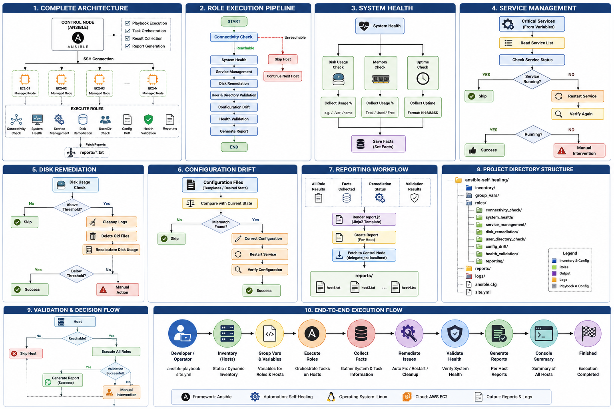

# Self-Healing Ansible: Server Monitoring & Remediation

Idempotent, role-based Ansible solution that checks a fleet of Linux (AWS EC2)
servers, automatically fixes recoverable problems, re-validates the fix, and
generates a per-host remediation report. Servers it can't fix are flagged for
manual intervention instead of being silently left broken.

## What it does

| Step                     | Role                    | Behaviour |
|---------------------------|--------------------------|-----------|
| 1. Connectivity            | `connectivity_check`     | Pings the host; unreachable hosts are flagged and skipped (`meta: end_host`) |
| 2. Health snapshot          | `system_health`          | Disk %, memory %, uptime — registered as facts |
| 3. Service management       | `service_management`     | Checks `critical_services`, restarts any that aren't `running`, re-verifies |
| 4. Disk remediation         | `disk_remediation`       | If disk usage > threshold, deletes old files per `log_cleanup_paths`, re-checks |
| 5. User/directory drift     | `user_directory_check`   | Ensures `required_users` and `required_directories` exist with correct owner/mode |
| 6. Config drift             | `config_drift`           | Example: enforces `PermitRootLogin no` in sshd_config, corrects hostname mismatches, restarts sshd via handler |
| 7. Post-remediation health  | `health_validation`      | Re-checks disk/memory/services after all fixes; fails validation into `manual_intervention_required` if still bad |
| 8. Reporting                | `reporting`               | Renders a `.txt` report on the host, fetches it to `./reports/`, prints a console summary |

## Structure

```
ansible-self-healing/
├── ansible.cfg
├── site.yml                  # main playbook - runs all roles in order
├── inventory/hosts           # your EC2 hosts (edit this)
├── group_vars/all.yml        # ALL tunable variables live here
├── roles/
│   ├── connectivity_check/
│   ├── system_health/
│   ├── service_management/   # has handlers not needed; restart is direct + re-verified
│   ├── disk_remediation/
│   ├── user_directory_check/
│   ├── config_drift/         # has handlers/main.yml (restart sshd)
│   ├── health_validation/
│   └── reporting/
│       └── templates/report.j2
└── reports/                  # fetched reports land here (gitignore this)
```
## 🏗 Architecture




## Usage

1. Edit `inventory/hosts` with your real EC2 instances (or point
   `ansible.cfg`'s `inventory =` back at your existing dynamic inventory,
   e.g. `/opt/ansible/inventories/aws_ec2.yml`).
2. Edit `group_vars/all.yml` — this is the only file you should need to
   change for a new environment: thresholds, `critical_services`,
   `required_users`, `required_directories`, cleanup paths.
3. Dry run first (no changes made, shows diffs):
   ```
   ansible-playbook ./site.yml -e "host=aws_ec2" -i /opt/ansible/inventories/aws_ec2.yml --check --diff
   ```
4. Run for real:
   ```
   ansible-playbook ./site.yml -e "host=aws_ec2" -i /opt/ansible/inventories/aws_ec2.yml --list-hosts
   ansible-playbook ./site.yml -e "host=aws_ec2" -i /opt/ansible/inventories/aws_ec2.yml 
   ```
5. Target one host, or a group:
   ```
   ansible-playbook ./site.yml -e "host=aws_ec2" --limit <server_ip> -i /opt/ansible/inventories/aws_ec2.yml
   ```
6. Check `./reports/` for the generated report per host, and watch the
   console summary at the end of each play — hosts marked
   `NEEDS MANUAL INTERVENTION` list the specific reasons.

## Design notes (idempotency & error handling)

- Every remediation task is naturally idempotent (`file`, `user`, `systemd`,
  `lineinfile`, `hostname` modules) — running the playbook repeatedly with
  nothing wrong makes zero changes.
- `register` + `set_fact` build up per-host state (`manual_intervention_required`,
  `manual_intervention_reasons`) across all roles, consumed by `health_validation`
  and `reporting` at the end.
- `ignore_errors: true` / `failed_when: false` is used only on checks and
  best-effort remediation steps, never on the final validation — so a
  server that can't actually be fixed is reported, not marked healthy.
- `any_errors_fatal: false` at the play level means one broken host doesn't
  stop remediation of the rest of the fleet.
- `meta: end_host` skips all further roles for a host that fails the initial
  connectivity check, so you don't waste time (or produce misleading
  reports) trying to fix a box you can't reach.
- The `config_drift` role uses a handler (`restart sshd`) plus
  `meta: flush_handlers` so the service picks up the corrected config
  immediately, within the same run, before `health_validation` checks it.

## Extending it

- Add more services: just add names to `critical_services` in
  `group_vars/all.yml`.
- Add more config-drift checks: follow the pattern in
  `roles/config_drift/tasks/main.yml` (a `lineinfile`/`template` task,
  a handler if a service needs restarting, and a `set_fact` to log the fix).
- Add more cleanup targets: add entries to `log_cleanup_paths`.
